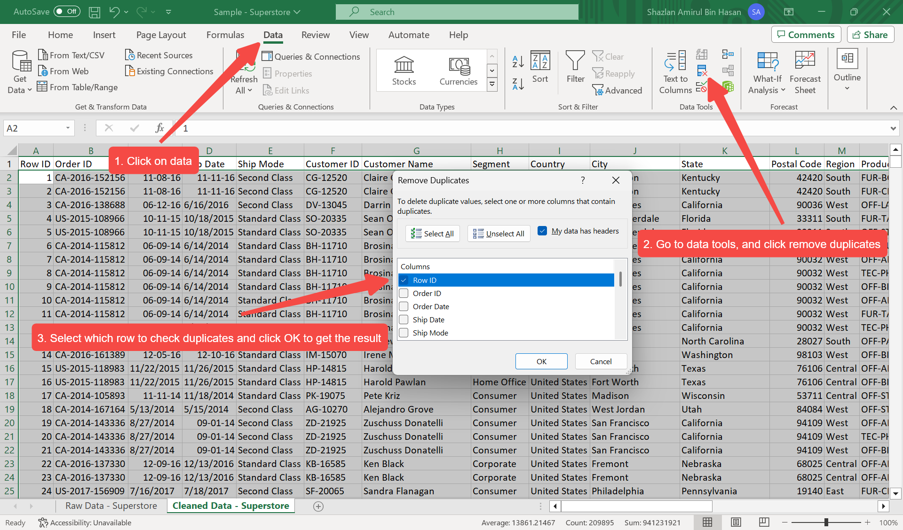
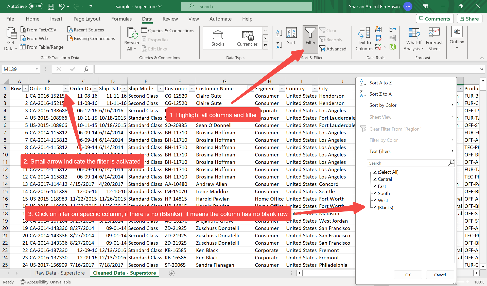
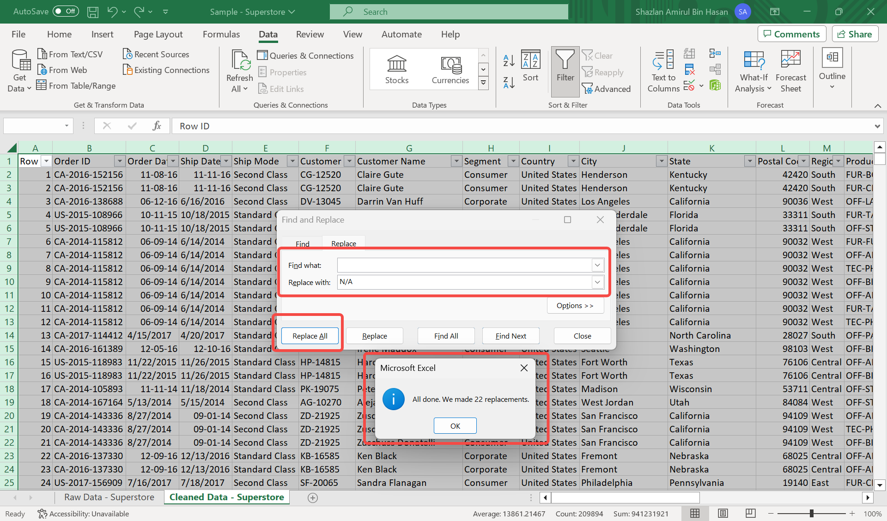
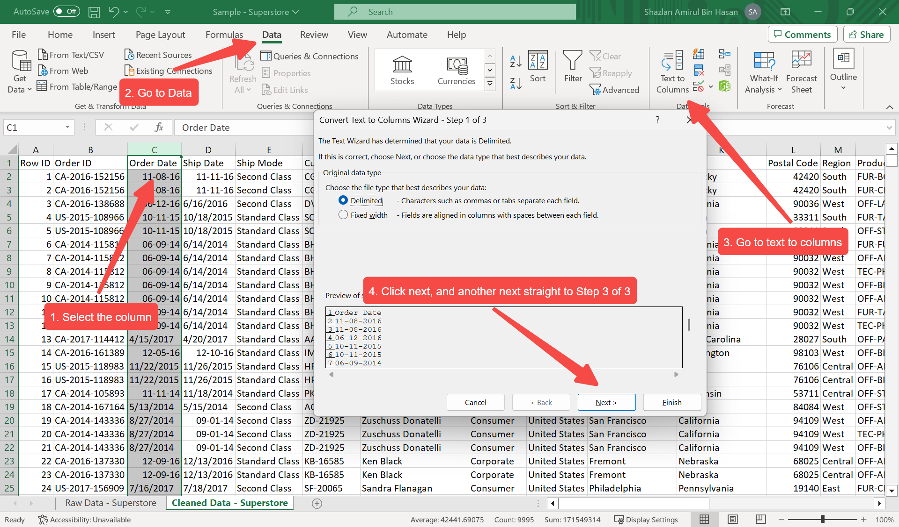
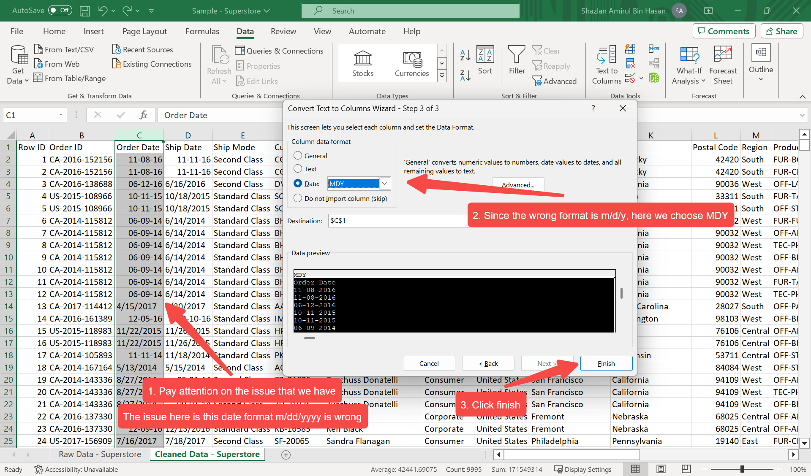
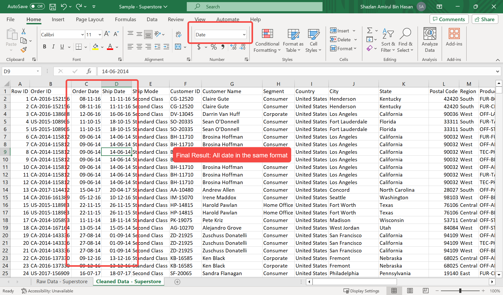
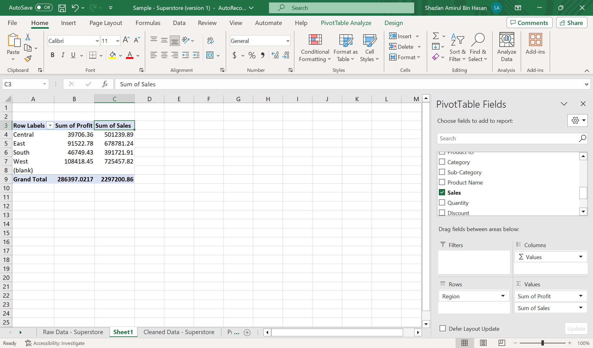
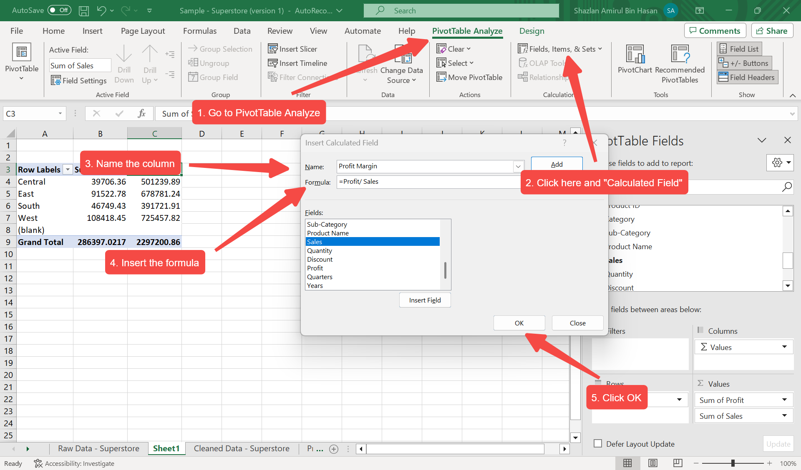
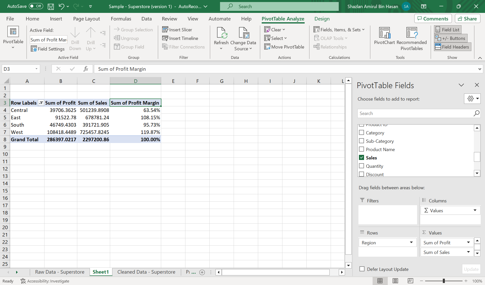

# Excel Portfolio
I will demonstrate my advanced excel skills in this portfolio.

# Global Superstore Dataset
To analyze global sales, profit, and customer trends to uncover key insights that can improve business decision-making across regions and product categories.

# Data Cleaning
Typical steps for formal data cleaning in Excel include:
- Remove duplicates
- Check for blanks row
- Convert date
- Sort and verify order date
- Add column helper to separate year and date

The goal for the data cleaning is to ensure accuracy, consistency, and readiness for analysis. Each cleaning step from removing duplicates to adding helper columns are to improves the reliability of our results and makes the data easier to analyze through Pivot Tables and Dashboards.

## Screenshot and Explanation

### 1. Remove Duplicates

- In this dataset, removing duplicates ensures that each Row ID is unique, preventing inflated totals in sales, profit, or quantity.  
- If no duplicates are found, Excel displays: *“No duplicate values found”*.  
- This step is critical to maintain data integrity before proceeding with analysis.

### 2. Check for Blanks

- The objective of checking for blank or missing values is to ensure data accuracy and reliability during analysis, especially when using Pivot Tables and charts.
- Blanks can be deleted or change blank to N/A by Ctrl + H > Find What (leave blank) > Replace With (N/A) > Replace All

### 3. Convert Date
Step 1

Step 2

Step 3

- Mixed date formats (e.g., mm/dd/yyyy, dd-mm-yy) are common in raw data. Before analysis, all dates should be standardized to dd-mm-yy format and recognized by Excel as true date values.
- To check if Excel reads the value as a date:
    - Right-aligned cells → stored as actual dates
    - Left-aligned cells → stored as text (Excel can’t calculate or sort them correctly)
- Getting the dates in the same format help us a lot in analyzing the data.

# Analyzing the Data
Now that the data has been cleaned, let's do the analyzing part. I asked ChatGPT to act as my manager and give me any instructions based on the data.

## 1. Profit Margin by Region
- Profit Margin = PROFIT / SALES
- Since the dataset already contained both Profit and Sales, I could either add a new column manually or create the field directly inside the Pivot Table.
- For my usual practice, I prefer to calculate it within the Pivot Table using a Calculated Field, which ensures the value updates automatically when the data refreshes.

A Pivot Table summarizing Sales and Profit by Region.

Step to add a Calculated Field for Profit Margin inside the Pivot Table.

Final result. Once getting the profit margin, I have to right-click > Show Values As > % of Grand total
