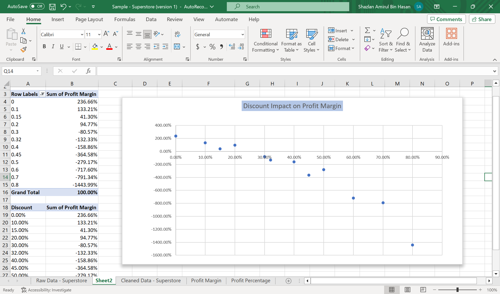
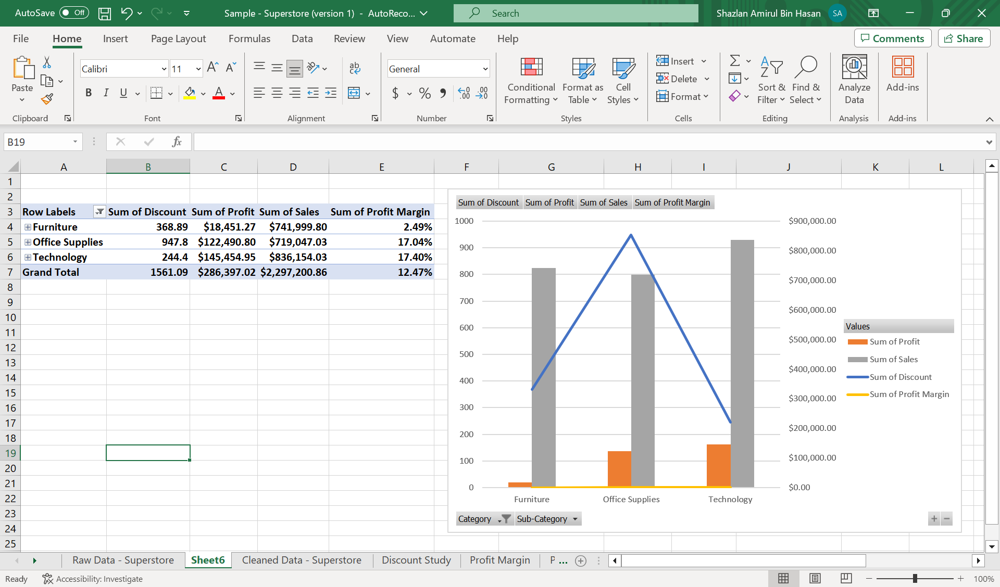

# Excel Portfolio
I will demonstrate my advanced excel skills in this portfolio.

# Global Superstore Dataset
To analyze global sales, profit, and customer trends to uncover key insights that can improve business decision-making across regions and product categories.

# Data Cleaning
Typical steps for formal data cleaning in Excel include:
- Remove duplicates
- Check for blanks row
- Convert date
- Sort and verify order date
- Add column helper to separate year and date

The goal for the data cleaning is to ensure accuracy, consistency, and readiness for analysis. Each cleaning step from removing duplicates to adding helper columns are to improves the reliability of our results and makes the data easier to analyze through Pivot Tables and Dashboards.

## Screenshot and Explanation

### 1. Remove Duplicates

- In this dataset, removing duplicates ensures that each Row ID is unique, preventing inflated totals in sales, profit, or quantity.  
- If no duplicates are found, Excel displays: *“No duplicate values found”*.  
- This step is critical to maintain data integrity before proceeding with analysis.

### 2. Check for Blanks

- The objective of checking for blank or missing values is to ensure data accuracy and reliability during analysis, especially when using Pivot Tables and charts.
- Blanks can be deleted or change blank to N/A by Ctrl + H > Find What (leave blank) > Replace With (N/A) > Replace All

### 3. Convert Date
Step 1

Step 2

Step 3

- Mixed date formats (e.g., mm/dd/yyyy, dd-mm-yy) are common in raw data. Before analysis, all dates should be standardized to dd-mm-yy format and recognized by Excel as true date values.
- To check if Excel reads the value as a date:
    - Right-aligned cells → stored as actual dates
    - Left-aligned cells → stored as text (Excel can’t calculate or sort them correctly)
- Getting the dates in the same format help us a lot in analyzing the data.

# Analyzing the Data
Now that the data has been cleaned, let's do the analyzing part. I asked ChatGPT to act as my manager and give me any instructions based on the data.

## 1. Profit Margin by Region
Objective
- To identify which region contributes the highest profitability and which region has lower margins, providing insights into regional performance, pricing efficiency, and cost structure differences.

Steps
- Profit Margin = PROFIT / SALES
- Since the dataset already contained both Profit and Sales, I could either add a new column manually or create the field directly inside the Pivot Table.
- For my usual practice, I prefer to calculate it within the Pivot Table using a Calculated Field, which ensures the value updates automatically when the data refreshes.

A Pivot Table summarizing Sales and Profit by Region.

Step to add a Calculated Field for Profit Margin inside the Pivot Table.

Final result. Once getting the profit margin, I have to right-click > Show Values As > % of Grand total

### Insight
From the Pivot Table analysis, it can be concluded that the West region achieved the highest profit margin, while the Central region recorded the lowest. Regional performance differences are likely influenced by variations in discount strategies, product mix, marketing approaches, or delivery costs. These findings help prioritize which regions may benefit from improved pricing efficiency or cost optimization initiatives.
- Improving pricing efficiency means reviewing price points and discount levels to ensure each region captures the maximum possible margin.
- Cost optimization focuses on identifying and reducing operational expenses, such as logistics or marketing, to improve overall profit margins

## 2. Discount Impact on Profit Margin
Objective
- To analyze how varying discount levels affect profitability, and determine the threshold where high discount rates begin to negatively impact profit margins. This helps understand the trade-off between sales volume and profitability.

Steps
- To analyze discount impact on profit margin, I have to create a pivot table with discount on row and profit margin on value.
- I have to create a scatter chart to see the behaviour of discount rate that influence profit margin

### Insight
From the scatter chart, we can clearly see that the more discount we give to customers, the lower profit margin we will receive. The pattern shows that discounts below 20% is more profitable, while aggressive discounting above 40% results in losses.

## 3. Sales by Category
Objective
- Evaluate which product category contributes most to total sales and profitability. We want to identify whether high sales also mean high profit or if some categories are popular but not profitable.

Steps
- Putting category in rows and discount, profit, sales and profit margin in values in order to analyze total sales by category in detail

### Insight
Overall, the total profit margin stands at 12.47%, with the Technology category leading at 17.40%, closely followed by Office Supplies at 17.04%. The Furniture category recorded the lowest profit margin at only 2.49%, significantly behind the other two. This suggests that while Furniture generates high sales, its profitability is limited likely due to higher product costs or lower markup percentages. Improving pricing or reducing production and shipping costs could help increase margins in this category.

## 4. Customer Segment Analysis
Objective
- To analyze sales performance and profitability across customer segments. The goal is to understand which segment (Consumer, Corporate, or Home Office) contributes the most to overall revenue and profit, helping identify the most valuable customer group for business growth.

Steps
- Put segment in row, profit, sales and profit margin in values in order to study customer behaviours.

### Insight
In both profit and sales, the Home Office segment generates the lowest total; however, it achieves the highest profit margin compared to the Consumer and Corporate segments. The margin difference is relatively small, around 1%–2%, suggesting that all segments perform at a similar level of efficiency. This indicates that the business maintains a consistent pricing and cost strategy across customer segments.

## 5. The Final Dashboard
